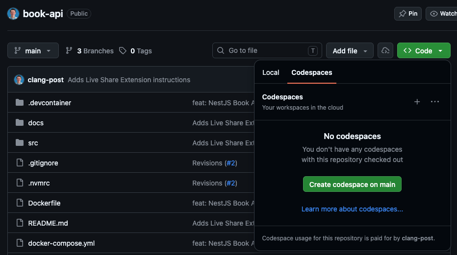

# Overview

This repository contains a simple REST API for managing **Books** and **Authors**. 

It is deliberately incomplete in two areas so that a candidate can demonstrate their ability to:

1. Identify a missing deduplication constraint.
2. Identify an incorrect relationship between the `book` and `author` tables.

---

## Interview Setup

### GitHub Codespaces



1. Click the green **Code** button on the repository page.
2. Select the **Codespaces** tab.
3. Click **Create Codespace** on the current branch (main).
4. Wait for the environment to initialize.

### Install the Live Share Extension (Host & Guest)

- Open the Extensions view by clicking the Extensions icon in the Activity Bar on the left (the icon looks like four blocks).
- Search for Live Share (published by Microsoft).
- Click Install.

### Start the Session (Host)

- Click on the Live Share icon that appears in the Activity Bar on the left, or click Live Share in the bottom status bar.
- You will be prompted to sign in using either a GitHub or Microsoft account.
- Once signed in, click Share in the Live Share view.
- A notification will appear in the bottom right corner confirming the session has started, and an invitation link will be automatically copied to your clipboard.

### Grant Terminal Access (Host)

By default, Live Share only shares your code. Terminals are kept private for security reasons. To give the other person terminal access:

- Open the Live Share view from the Activity Bar on the left.
- Scroll down to the Shared Terminals section.
- Click the Share terminal icon (it looks like a plus sign or a terminal icon).
- Select Read/Write from the dropdown menu to allow the guest to run commands. (Select Read-only if you only want them to see the output).

### Join the Session (Guest)

- The host needs to send the copied invitation link to the guest (via chat, email, etc.).
- The guest clicks the link. They will be prompted to open the session in their local Visual Studio Code application or in the browser.
- The guest will need to sign in with their GitHub or Microsoft account to join.
- Once connected, you will both see each other's cursors, be able to edit the code simultaneously, and use the shared terminal.

---

## Database Schema

### `author`

| Column      | Type    | Notes              |
|-------------|---------|--------------------|
| id          | INTEGER | Primary key (auto) |
| firstName   | TEXT    | Author's first name |
| lastName    | TEXT    | Author's last name  |
| country     | TEXT    | Author's country    |

### `book`

| Column   | Type    | Notes              |
|----------|---------|--------------------|
| id       | INTEGER | Primary key (auto) |
| title    | TEXT    | Book title         |
| authorId | INTEGER | Author reference   |
| isbn     | TEXT    | ISBN number        |

> **Note:** Author and book are one-to-one right now, but a test assumes a book can have multiple authors. This is one of the things a candidate is asked to fix.

---

## API Endpoints

### Authors

| Method | Endpoint        | Description           |
|--------|-----------------|-----------------------|
| GET    | `/authors`      | Get all authors        |
| GET    | `/authors/:id`  | Get author by ID       |
| POST   | `/authors`      | Create a new author    |

**POST `/authors` body:**
```json
{
  "firstName": "Jane",
  "lastName": "Austen",
  "country": "England"
}
```

### Books

| Method | Endpoint     | Description       |
|--------|--------------|-------------------|
| GET    | `/books`     | Get all books      |
| GET    | `/books/:id` | Get book by ID     |
| POST   | `/books`     | Create a new book  |

**POST `/books` body:**
```json
{
  "title": "Pride and Prejudice",
  "authorId": 1,
  "isbn": "978-0-14-143951-8"
}
```

> **Note:** `POST` **always** creates a new record, even if the same title already exists. This is intentional and is one of the things a candidate is asked to fix.

---

## Getting Started

### Local Development

**Prerequisites:** Node.js ≥ 18, pnpm ≥ 9

```bash
# Install dependencies
pnpm install

# Start the API in development mode
pnpm start:dev

# The API will be available at http://localhost:3000
```

### Docker

```bash
# Build and start the container
docker-compose up --build

# The API will be available at http://localhost:3000
```

---

## Interview Guide

This repository contains **15 unit tests**:

- **13 tests pass** — they validate the existing, working functionality of the `BookService` and `AuthorService`.
- **2 tests intentionally fail** — they describe features that are **not yet implemented**. The candidate should:
    1. Run the tests, observe which ones fail and why.
    2. Investigate the codebase to understand the current design.
    3. Propose and implement fixes to make the failing tests pass.

The two failing tests are:

- **"should not create a duplicate book if the title already exists"**
  - this test checks for deduplication of books
- **"should allow a book to have multiple authors"**
  - this test assumes that a book can have multiple authors, but the current schema only allows one

### Tips

If the candidate is struggling:

- Help them decipher what the code is currently doing.
- Ask how they would use AI to troubleshoot and debug.
- Encourage them to use AI and search engines to decipher syntax, understand error messages, and find solutions.

### Suggested talking points

- Why does the API create a duplicate book instead of returning an existing one?
- Why can't a book have more than one author right now?
- What is idempotency and how does it apply to the POST endpoint?
- How comfortable do you feel about Vitest, TypeScript, Nest.js, and Node.js in general?
- What would you change, do differently, or extend if you were designing this API?
